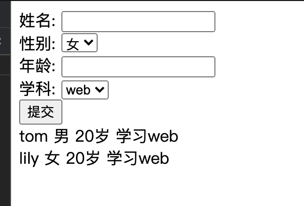

# 作业

### 根据所给的index.njk页面，完成学生的信息录入功能


1. 信息包括

   ```json
    {
    	 "name":String,
      "gender":Number,
      "age":Number,
      "major":String,
    }
   ```

2. 将信息录入students collection中

3. 在njk文件，class为student-list的div中，每次刷新都能获取最新的学生们的数据，其中的for循环代码已经存在，请继续完成后续内容，完成后如下：



